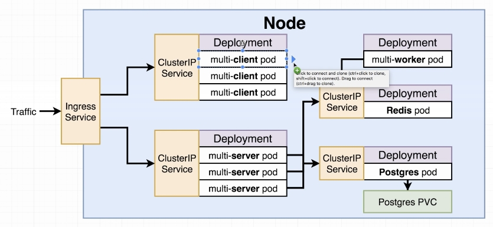
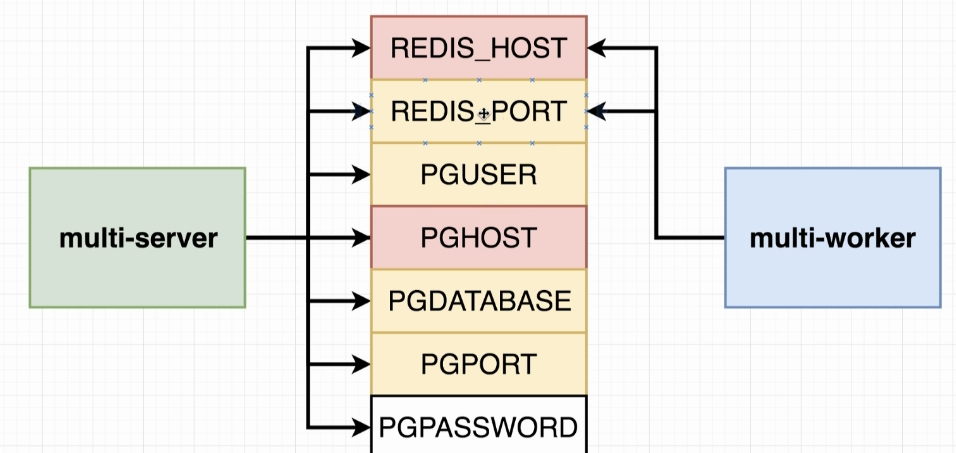
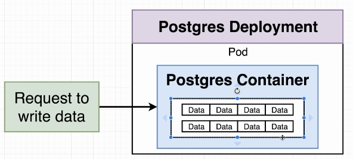
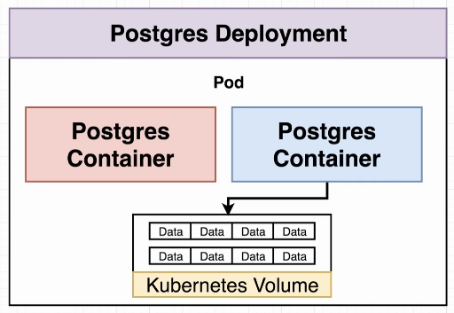
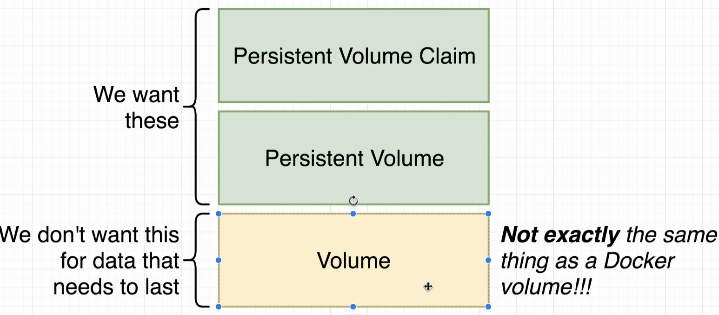
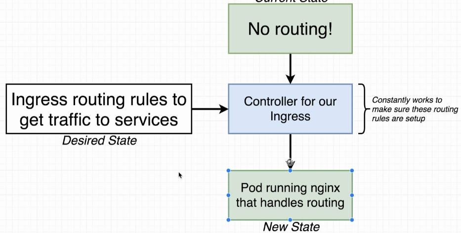
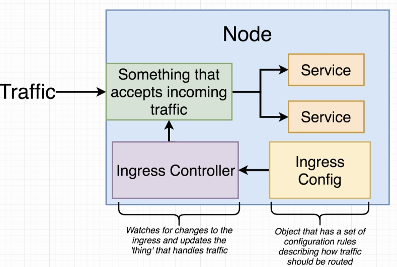
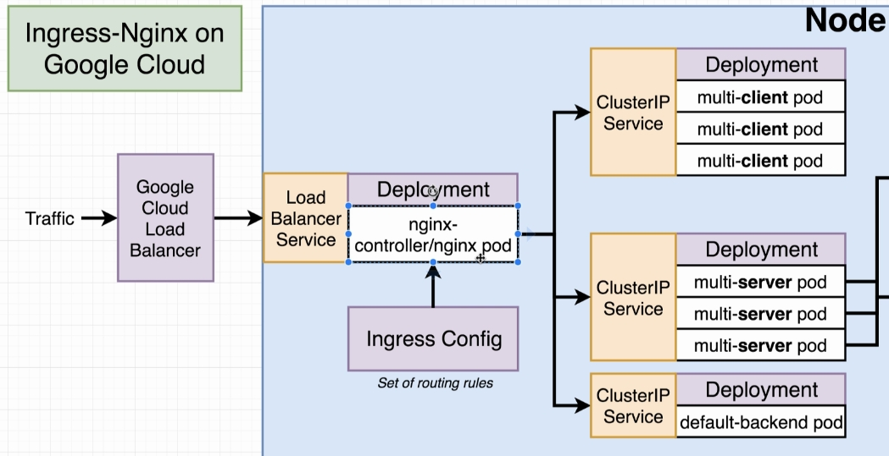

# Multi-Docker Fibonacci Sequence Calculator

[](https://travis-ci.org/AndLydakis/FibCalc)

Part of [this course](https://github.com/AndLydakis/DockerK8s)

* React/Express App
* Postgres DB maintains keys already calculated
* Redis maintains results indices-value pairs, or contacts Node.js worker to calculate new values

### Project Overview
  

### Project Flow

  

    

### End Deployed Structure

 


#### Environment Vars

  
* Yellow: Constant Values
* Red: URL vals that tell multi-server and multi-worker how to connect to services

### Volumes  

   

   

If the pod is destroyed the volume is destroyed

  
    
### Don't have multiple postgres containers accessing the same volume by incrementing ```replicas```  

# Ingress Controller
* routing rules to get traffic to services  







### This project uses [ingress-nginx](https://github.com/kubernetes/ingress-nginx)  

#### After Deployment go to Google cloud dashboard -> Clusters -> Services  

### Travis workflow:


### EBS file
* [Dockerrun.aws.json](./Dockerrun.aws.json) -> config file for Elastic Beanstalk, similar to docker-compose


  

### [ECS Documentation (container definitions)](https://docs.aws.amazon.com/AmazonECS/latest/developerguide/task_definition_parameters.html)  

  