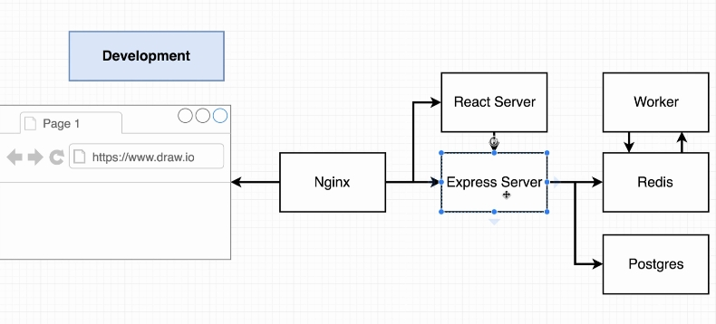
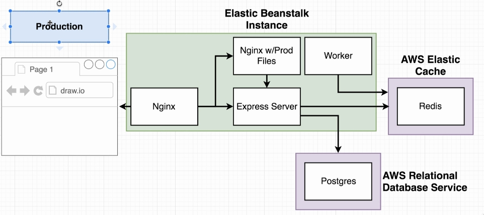
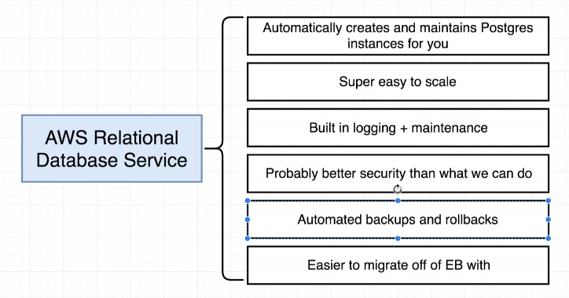
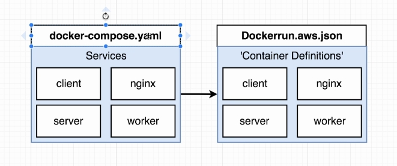
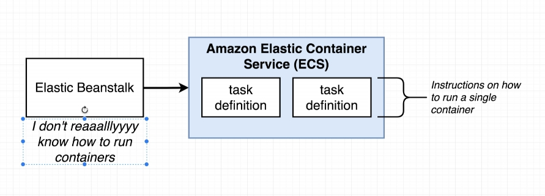
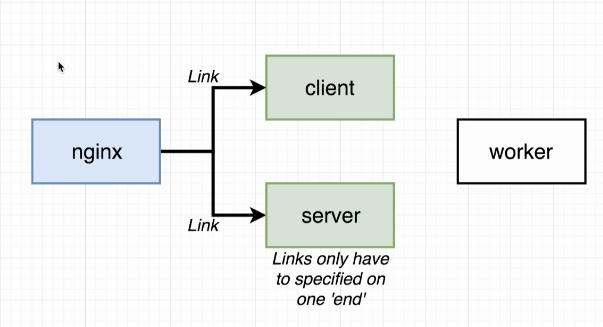

# Multi-Docker Fibonacci Sequence Calculator

[](https://travis-ci.org/AndLydakis/FibCalc)

Part of [this course](https://github.com/AndLydakis/DockerK8s)

* React/Express App
* Postgres DB maintains keys already calculated
* Redis maintains results indices-value pairs, or contacts Node.js worker to calculate new values

### Project Overview
  

### Project Flow

  

    

### End Deployed Structure

  

  

  

  

To create client React app:
    * npx create-react-app client
    * delete auto created ```.git``` repo.
    
### Travis workflow:


### EBS file
* [Dockerrun.aws.json](./Dockerrun.aws.json) -> config file for Elastic Beanstalk, similar to docker-compose



  

### [ECS Documentation (container definitions)](https://docs.aws.amazon.com/AmazonECS/latest/developerguide/task_definition_parameters.html)  

  